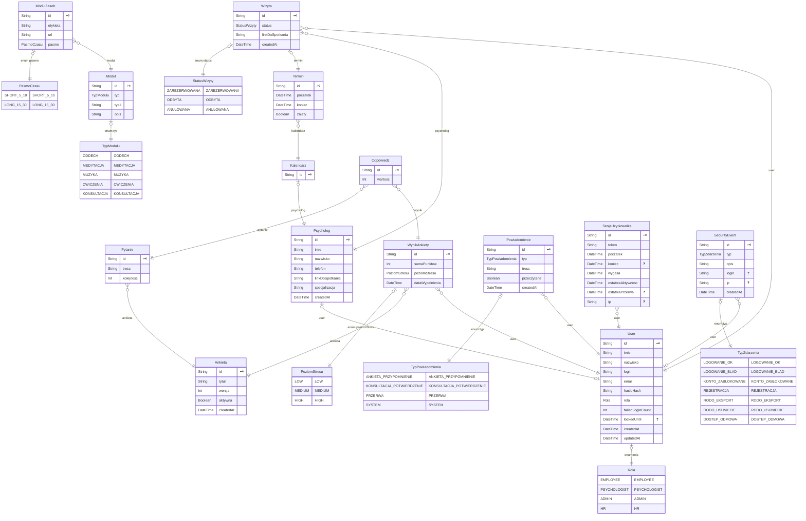

```mermaid
erDiagram

        Rola {
            EMPLOYEE EMPLOYEE
PSYCHOLOGIST PSYCHOLOGIST
ADMIN ADMIN
HR HR
        }
    


        PoziomStresu {
            LOW LOW
MEDIUM MEDIUM
HIGH HIGH
        }
    


        TypModulu {
            ODDECH ODDECH
MEDYTACJA MEDYTACJA
MUZYKA MUZYKA
CWICZENIA CWICZENIA
KONSULTACJA KONSULTACJA
        }
    


        PasmoCzasu {
            SHORT_5_10 SHORT_5_10
LONG_15_30 LONG_15_30
        }
    


        StatusWizyty {
            ZAREZERWOWANA ZAREZERWOWANA
ODBYTA ODBYTA
ANULOWANA ANULOWANA
        }
    


        TypPowiadomienia {
            ANKIETA_PRZYPOMNIENIE ANKIETA_PRZYPOMNIENIE
KONSULTACJA_POTWIERDZENIE KONSULTACJA_POTWIERDZENIE
PRZERWA PRZERWA
SYSTEM SYSTEM
        }
    


        TypZdarzenia {
            LOGOWANIE_OK LOGOWANIE_OK
LOGOWANIE_BLAD LOGOWANIE_BLAD
KONTO_ZABLOKOWANE KONTO_ZABLOKOWANE
REJESTRACJA REJESTRACJA
RODO_EKSPORT RODO_EKSPORT
RODO_USUNIECIE RODO_USUNIECIE
DOSTEP_ODMOWA DOSTEP_ODMOWA
        }
    
  "User" {
    String id "🗝️"
    String imie 
    String nazwisko 
    String login 
    String email 
    String hasloHash 
    Rola rola 
    Int failedLoginCount 
    DateTime lockedUntil "❓"
    DateTime createdAt 
    DateTime updatedAt 
    }
  

  "Psycholog" {
    String id "🗝️"
    String imie 
    String nazwisko 
    String telefon 
    String linkDoSpotkania 
    String specjalizacja 
    DateTime createdAt 
    }
  

  "Kalendarz" {
    String id "🗝️"
    }
  

  "Termin" {
    String id "🗝️"
    DateTime poczatek 
    DateTime koniec 
    Boolean zajety 
    }
  

  "Wizyta" {
    String id "🗝️"
    StatusWizyty status 
    String linkDoSpotkania 
    DateTime createdAt 
    }
  

  "Ankieta" {
    String id "🗝️"
    String tytul 
    Int wersja 
    Boolean aktywna 
    DateTime createdAt 
    }
  

  "Pytanie" {
    String id "🗝️"
    String tresc 
    Int kolejnosc 
    }
  

  "WynikAnkiety" {
    String id "🗝️"
    Int sumaPunktow 
    PoziomStresu poziomStresu 
    DateTime dataWypelnienia 
    }
  

  "Odpowiedz" {
    String id "🗝️"
    Int wartosc 
    }
  

  "Modul" {
    String id "🗝️"
    TypModulu typ 
    String tytul 
    String opis 
    }
  

  "ModulZasob" {
    String id "🗝️"
    String etykieta 
    String url 
    PasmoCzasu pasmo 
    }
  

  "Powiadomienie" {
    String id "🗝️"
    TypPowiadomienia typ 
    String tresc 
    Boolean przeczytane 
    DateTime createdAt 
    }
  

  "SesjaUzytkownika" {
    String id "🗝️"
    String token 
    DateTime poczatek 
    DateTime koniec "❓"
    DateTime wygasa 
    DateTime ostatniaAktywnosc 
    DateTime ostatniaPrzerwa "❓"
    String ip "❓"
    }
  

  "SecurityEvent" {
    String id "🗝️"
    TypZdarzenia typ 
    String opis 
    String login "❓"
    String ip "❓"
    DateTime createdAt 
    }
  
    "User" |o--|| "Rola" : "enum:rola"
    "Psycholog" |o--|o "User" : "user"
    "Kalendarz" |o--|| "Psycholog" : "psycholog"
    "Termin" }o--|| "Kalendarz" : "kalendarz"
    "Wizyta" }o--|| "User" : "user"
    "Wizyta" }o--|| "Psycholog" : "psycholog"
    "Wizyta" |o--|| "Termin" : "termin"
    "Wizyta" |o--|| "StatusWizyty" : "enum:status"
    "Pytanie" }o--|| "Ankieta" : "ankieta"
    "WynikAnkiety" }o--|| "User" : "user"
    "WynikAnkiety" }o--|| "Ankieta" : "ankieta"
    "WynikAnkiety" |o--|| "PoziomStresu" : "enum:poziomStresu"
    "Odpowiedz" }o--|| "WynikAnkiety" : "wynik"
    "Odpowiedz" }o--|| "Pytanie" : "pytanie"
    "Modul" |o--|| "TypModulu" : "enum:typ"
    "ModulZasob" }o--|| "Modul" : "modul"
    "ModulZasob" |o--|| "PasmoCzasu" : "enum:pasmo"
    "Powiadomienie" }o--|| "User" : "user"
    "Powiadomienie" |o--|| "TypPowiadomienia" : "enum:typ"
    "SesjaUzytkownika" }o--|| "User" : "user"
    "SecurityEvent" }o--|o "User" : "user"
    "SecurityEvent" |o--|| "TypZdarzenia" : "enum:typ"
```
